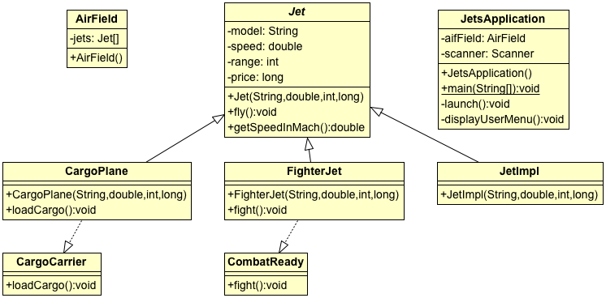

## Jets Application

Description: This application allows for the management of an inventory of jets and pilots in an airfield.  There are several subclasses of jets, with different versions of inherited methods. Pilots are randomly assigned to a jet upon the start of the application.  

### Technologies
* Java
* Object-oriented design
  * Polymorphism
  * Inheritance
  * Abstraction
  * Encapsulation
  * Interface
<<<<<<< HEAD
* UML Diagrams - 
=======
* UML Diagrams
>>>>>>> 67c1a0905c103ce707eb1ba57857b6b936e313d5
* Randomization

